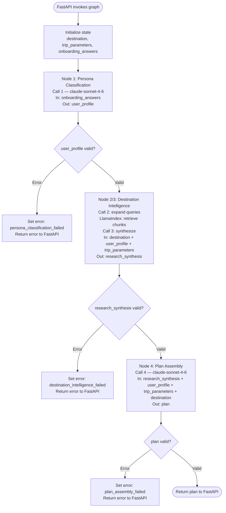
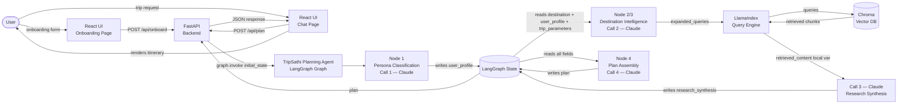

# Agent Architecture Specification

## Implementation Update

### Current State (Sprint 2 — by May 31)

**No code written — fully in design phase.** Architecture is being designed forward from context management and evaluation artifacts.

**Sprint 2 scope locked:**
- Module 1: Onboarding (structured questions → persona classification → user profile)
- Module 2: Research + Planning pipeline (RAG retrieval → synthesis → itinerary generation)
- React web app (Vite + Tailwind + shadcn/ui) — 2 pages: onboarding + chat/results
- FastAPI backend — bridges React ↔ LangGraph
- DeepEval eval set wired to 10 CSV test cases

**Tech stack confirmed:**

| Layer | Tech |
|---|---|
| LLM | Claude (claude-sonnet-4-6) |
| Orchestration | LangGraph |
| RAG / Indexing | LlamaIndex |
| Backend API | FastAPI |
| Frontend | React (Vite + Tailwind + shadcn/ui) |
| Evaluation | DeepEval |
| Vector DB | Chroma (local, no infra needed for Sprint 2) |

### Priority Quality Risk

**Context Awareness Failure** — the agent ignores stated soft constraints (kid age, elderly pace, budget) OR misses unstated local risks (Kamakhya queues, Shillong return timing).

Two angles:
- **Angle A** (explicit constraints ignored): user_profile fields not passed correctly to planning calls
- **Angle B** (implicit local risks missed): RAG doesn't retrieve the right content, or retrieved content isn't surfaced in synthesis

Both angles are addressed by the 4-call LLM pipeline with correct context flow through LangGraph state.

### LLM Call Pipeline (from context management workflow)

| Call | Purpose | Risk Connection |
|---|---|---|
| Call 1 — Persona Classification | onboarding_answers → structured user_profile | 8/10 — wrong persona = wrong context downstream |
| Call 2 — RAG Query Expansion | trip request + user_profile → expanded retrieval queries | 5/10 — affects retrieval quality |
| Call 3 — Research Synthesis | retrieved_content + user_profile → structured destination research | 9/10 — Angle B passes or fails here |
| Call 4 — Plan Generation | research_synthesis + user_profile + trip_parameters → actionable itinerary | 10/10 — Angle A passes or fails here |

**No changes to implementation state or quality risk since context management workflow.** This baseline applies directly.

---

## Context Domain Clustering

### LLM Call × Context Field Matrix

Fields used by each call (post-waste-removal schemas):

| LLM Call | onboarding_answers | destination | user_profile | trip_parameters | retrieved_content | research_synthesis |
|---|:---:|:---:|:---:|:---:|:---:|:---:|
| Call 1 — Persona Classification | ✓ (R) | optional (R) | — (W) | | | |
| Call 2 — RAG Query Expansion | | ✓ (R) | ✓ (R) | ✓ (R) | | |
| Call 3 — Research Synthesis | | ✓ (R) | ✓ (R) | ✓ (R) | ✓ (R) | — (W) |
| Call 4 — Plan Generation | | ✓ (R) | ✓ (R) | ✓ (R) | | ✓ (R) |

*(R = reads, W = writes, — = produces this field)*

**Shared fields:** `destination`, `user_profile`, `trip_parameters` are read by Calls 2, 3, and 4 — these three form the backbone of the pipeline.

**Direct output→input chains:**
- Call 1 → writes `user_profile` → read by Calls 2, 3, 4
- Call 2 → writes `expanded_queries` → drives LlamaIndex retrieval → produces `retrieved_content` for Call 3
- Call 3 → writes `research_synthesis` → read exclusively by Call 4

---

### Identified Clusters

**Cluster A — User Understanding** (Call 1)

Reasoning focus: *"Who is this traveller and what constraints do they carry into every downstream decision?"*

- Inputs: onboarding_answers from React UI
- Produces: `user_profile` (persona_type, autonomy_mode, constraints) — the single most-shared piece of context in the entire pipeline
- Isolated field overlap with Calls 2/3/4 — produces the context others consume, doesn't share inputs with them
- Clear boundary: runs once at session start, before trip planning begins

**Cluster B — Destination Intelligence** (Calls 2 + 3)

Reasoning focus: *"What do we know about this destination for this specific traveller, and what risks should surface before we commit to a plan?"*

- Call 2 and Call 3 share 3/4 of their input fields (destination, user_profile, trip_parameters)
- Call 2's output drives LlamaIndex retrieval → Call 3 receives the retrieved chunks
- These calls reason about the same object: destination-specific knowledge filtered through the user's persona
- Call 3's output (research_synthesis) is the entire input knowledge base for Call 4

**Cluster C — Plan Assembly** (Call 4)

Reasoning focus: *"Given what we know about this destination and this traveller, what itinerary satisfies every constraint?"*

- Reads research_synthesis (from Cluster B) + user_profile (from Cluster A) + trip_parameters
- Produces the final artefact: day-by-day plan, hotels, budget, warnings
- Distinct reasoning mode from Cluster B — synthesis was about knowledge; assembly is about constraint satisfaction and sequencing

---

### Shared Context Services (not clusters)

**LlamaIndex / Chroma — RAG Retrieval Service**
- Sits between Calls 2 and 3: receives expanded_queries from Call 2, returns ranked chunks to Call 3
- Pure retrieval — no reasoning, no state, stateless tool call
- Same input always produces same output type (given stable index)
- Shared service: could serve other retrieval needs in Sprint 3 without belonging to any single agent

**FastAPI — Request/Response Bridge**
- Routes React UI requests to LangGraph, serialises plan output back to React
- No reasoning, no state owned by FastAPI itself
- Shared service: transport layer only

---

### Clustering Summary

| | Count | Names |
|---|---|---|
| Clusters (reasoning domains) | 3 | User Understanding, Destination Intelligence, Plan Assembly |
| Shared services | 2 | RAG Retrieval (LlamaIndex/Chroma), API Bridge (FastAPI) |
| Total LLM calls | 4 | Calls 1–4 |

Calls 2+3 cluster together because they share context fields AND Call 2's output is the retrieval trigger for Call 3 — they're tightly coupled in the same information-gathering loop.

Cluster A (Call 1) is cleanly isolated: it consumes raw user input and produces the foundational context object that everything else reads. No downstream call writes back to it.

---

## Agent vs. Service Classification

### 3-Question Test Applied to Each Cluster

**Cluster A — User Understanding (Call 1)**

| Question | Answer | Reasoning |
|---|---|---|
| Does it need evolving state across multiple steps? | **No** | Runs once — onboarding_answers in, user_profile out. No iteration. |
| Does it need to choose between multiple next actions? | **No** | Always runs the same sequence. No branching. |
| Is there a stable object of concern it reasons about over time? | **No** | user_profile is computed once and handed off. Not refined over time. |

**Score: 0/3 → Service**

---

**Cluster B — Destination Intelligence (Calls 2 + 3)**

| Question | Answer | Reasoning |
|---|---|---|
| Does it need evolving state across multiple steps? | **Sprint 2: No** | Fixed pipeline: expand queries → retrieve → synthesize. One pass. |
| Does it need to choose between multiple next actions? | **Sprint 2: No** | No quality check on retrieval results, no re-query decision. Always the same sequence. |
| Is there a stable object of concern it reasons about over time? | **Yes** | The destination research document is the object — but assembled in one pass, not iterated. |

**Score: 1/3 → Service for Sprint 2**

*(Sprint 3 candidate: add a retrieval quality check that can decide to re-query with refined terms if local_risks is empty — this would promote it to agent. Directly addresses Angle B of Context Awareness Failure.)*

---

**Cluster C — Plan Assembly (Call 4)**

| Question | Answer | Reasoning |
|---|---|---|
| Does it need evolving state across multiple steps? | **Sprint 2: No** | Generates plan in one LLM call given full context. No refinement loop. |
| Does it need to choose between multiple next actions? | **Sprint 2: No** | Always generates the plan. No branching. |
| Is there a stable object of concern it reasons about over time? | **Yes** | The trip plan is the object — but assembled once, not iterated. |

**Score: 1/3 → Service for Sprint 2**

*(Sprint 3 candidate: add HITL refinement loop — user can say "change day 3" and the agent iterates. Promotes it to agent.)*

---

### Architecture Decision: Single-Agent Pipeline

All 3 clusters score as services for Sprint 2. But the overall system is not service-less — the LangGraph graph itself IS the agent.

**The right framing:**

The 4 LLM calls are **service nodes** inside one orchestrated **TripSathi Planning Agent**. The agent is the LangGraph graph — it has session state (`user_profile`, `trip_parameters`, `research_synthesis`), a clear goal (produce a personalised trip plan), and a defined start/end point. The individual nodes don't need their own control loops; the graph is the control structure.

This is a valid single-agent architecture: one agent, three internal service nodes, two external services.

---

### Final Architecture Overview: Single-Agent, Service-Node Pipeline

**1 Agent: TripSathi Planning Agent** (LangGraph graph)
- Session state owner: `user_profile`, `trip_parameters`, `destination`, `research_synthesis`
- Goal: transform onboarding + trip request into personalised itinerary
- Control structure: linear pipeline with defined state transitions (LangGraph edges)
- Quality risk owner: the agent is responsible for carrying user_profile through all nodes — if it drops, Context Awareness Failure fires

**3 Internal Service Nodes** (LangGraph nodes, no control loops of their own):
- Persona Classification Node (Call 1): reads onboarding_answers → writes user_profile to state
- Destination Intelligence Node (Calls 2+3 + LlamaIndex): reads state → writes research_synthesis to state
- Plan Assembly Node (Call 4): reads state → writes plan, returns to FastAPI

**2 External Services** (stateless, outside LangGraph graph):
- RAG Retrieval (LlamaIndex / Chroma): receives queries, returns ranked chunks — no reasoning, no state
- FastAPI Bridge: receives React request → invokes LangGraph graph → serialises response back to React

---

### Scope Check

**Agent count: 1** — within the bootcamp max-2 guideline, and appropriate for Sprint 2 scope.

**Sprint 3 promotions (deferred, YAGNI):**
- Destination Intelligence Node → Agent: add retrieval quality check + conditional re-query (Angle B quality gate)
- Plan Assembly Node → Agent: add HITL refinement loop (user modifies plan iteratively)

Neither promotion is needed to validate Context Awareness Failure in Sprint 2.

---

## Architecture Validation

### Check 1: Circular Dependencies ✅ Clean

Dependency flow is strictly linear:

```
React UI → FastAPI → [LangGraph]
  Node 1 (Persona Classification)
    ↓ writes user_profile to state
  Node 2+3 (Destination Intelligence)
    ↓ writes research_synthesis to state
  Node 4 (Plan Assembly)
    ↓ writes plan
[LangGraph] → FastAPI → React UI
```

No component reads from a component that reads from it. No circular dependency possible.

---

### Check 2: Unclear Context Ownership ✅ Clean

Each state field has exactly one writer:

| Field | Written by | Read by |
|---|---|---|
| `user_profile` | Node 1 only | Nodes 2, 3, 4 |
| `trip_parameters` | FastAPI (session init, before graph runs) | Nodes 2, 3, 4 |
| `destination` | FastAPI (session init) | Nodes 2, 3, 4 |
| `research_synthesis` | Node 3 only | Node 4 |
| `plan` | Node 4 only | FastAPI → React |

`trip_parameters` and `destination` are initialised by FastAPI as the LangGraph initial state — no node owns them, they're session inputs. This is correct: FastAPI is the state initialiser, not a node.

---

### Check 3: Orphaned Context — 1 Issue Found and Resolved

**Issue: `retrieved_content` scope**

`retrieved_content` (the LlamaIndex query result) appears in the context schemas as if it were a LangGraph state field. But it's only consumed immediately within the Destination Intelligence Node — Call 2 drives the LlamaIndex query, LlamaIndex returns chunks, Call 3 immediately consumes them.

Passing `retrieved_content` through LangGraph state would mean storing large RAG chunks in the graph state unnecessarily (already caught as a `call_only` retention policy in context management — but the architectural implication is clearer now).

**Resolution:** `retrieved_content` is an intra-node local variable within the Destination Intelligence Node. It is NOT a LangGraph state field. The node function calls LlamaIndex internally, receives chunks as a local Python variable, passes them directly to Call 3 within the same function, and only writes `research_synthesis` to LangGraph state.

This simplifies the LangGraph state schema:

**LangGraph state fields (corrected):**
```python
class TripSathiState(TypedDict):
    # Session inputs (initialised by FastAPI)
    destination: str
    trip_parameters: dict
    # Node outputs (written progressively)
    user_profile: dict          # written by Node 1
    research_synthesis: dict    # written by Node 2/3 cluster
    plan: dict                  # written by Node 4
```

`retrieved_content` and `expanded_queries` are local variables inside the Destination Intelligence Node function — they never touch LangGraph state.

---

### Check 4: Missing Handoff Paths ✅ Clean

All handoff paths accounted for:

| From | To | Mechanism |
|---|---|---|
| React UI (onboarding) | FastAPI | HTTP POST (form submission) |
| FastAPI | LangGraph state | `graph.invoke({"destination": ..., "trip_parameters": ...})` |
| Node 1 | Nodes 2/3/4 | LangGraph state `user_profile` (written then read) |
| Node 2 | LlamaIndex | Function call: `index.query(expanded_queries)` (local) |
| LlamaIndex | Node 3 | Return value (local variable, not state) |
| Node 3 | Node 4 | LangGraph state `research_synthesis` |
| Node 4 | FastAPI | LangGraph graph return value |
| FastAPI | React UI | HTTP response (JSON plan) |

---

### Check 5: Agent/Service Misclassification ✅ Clean

- **TripSathi Planning Agent (LangGraph graph):** Correctly an agent — it owns session state, orchestrates 4 LLM calls, and produces a goal-directed output. LangGraph graph IS the agent.
- **Persona Classification Node:** Stateless transformation (onboarding_answers → user_profile). Correctly a service node.
- **Destination Intelligence Node:** Fixed 2-call + retrieval sequence. No branching decisions for Sprint 2. Correctly a service node.
- **Plan Assembly Node:** Stateless transformation (state → plan). Correctly a service node.
- **LlamaIndex/Chroma:** Pure retrieval utility. Correctly an external service.
- **FastAPI:** Transport layer. Correctly an external service.

---

### Issues and Resolutions Summary

| Issue | Severity | Resolution |
|---|---|---|
| `retrieved_content` in LangGraph state | Medium (implementation risk) | Reclassified as intra-node local variable. Removed from LangGraph state schema. |

---

### Approved Architecture Snapshot

**TripSathi Planning Agent** — single LangGraph graph, 3 service nodes, 2 external services.

```
LangGraph State: {destination, trip_parameters, user_profile, research_synthesis, plan}

Node 1: Persona Classification
  In: onboarding_answers (from initial state)
  Out: user_profile → LangGraph state

Node 2/3: Destination Intelligence  
  In: destination, user_profile, trip_parameters (from state)
  Internal: expanded_queries → LlamaIndex → retrieved_content (local vars)
  Out: research_synthesis → LangGraph state

Node 4: Plan Assembly
  In: research_synthesis, user_profile, trip_parameters, destination (from state)
  Out: plan → LangGraph state → FastAPI response
```

This architecture is clean, buildable in Sprint 2, and directly tests Context Awareness Failure by requiring user_profile to flow correctly through all 3 nodes.

---

## Agent Control Logic

### TripSathi Planning Agent — Control Loop

The agent is the LangGraph graph. Its "control loop" is the LangGraph state machine: it transitions through nodes, updates shared state, and terminates when the plan is ready or an error occurs.

Sprint 2 control flow is linear — no iterative reasoning loops. The agentic quality comes from: (1) owning session state across 3 LLM calls, (2) making the user_profile propagation the architectural guarantee against Context Awareness Failure, and (3) handling per-node errors gracefully rather than crashing the whole pipeline.



**What makes this agentic (not just a function chain):**
- LangGraph state is the agent's working memory — `user_profile` written by Node 1 is available to Nodes 2/3/4 without being passed explicitly through function arguments
- The graph owns the session context boundary — FastAPI passes inputs in, gets the plan out; everything in between is the agent's responsibility
- Error handling is per-node: a failure in Node 2/3 doesn't corrupt Node 1's output; the agent reports which stage failed

**Termination conditions:**
- Normal: `plan` field is populated and valid → return plan
- Error: any node sets `error` field → return error message, no partial state exposed to user

---

### AgentContext Schema (LangGraph TypedDict)

```python
class TripSathiState(TypedDict):
    # ── Input-only (initialised by FastAPI, never mutated by nodes) ──────────
    destination: str
    trip_parameters: dict          # {duration_nights: int, budget_total: int,
                                   #  travel_dates: str, group_size: int}
    onboarding_answers: list[dict] # [{question: str, answer: str}, ...]

    # ── Agent-owned (written progressively by nodes) ─────────────────────────
    user_profile: dict | None      # written by Node 1
    research_synthesis: dict | None  # written by Node 2/3
    plan: dict | None              # written by Node 4

    # ── Control/meta ─────────────────────────────────────────────────────────
    current_node: str              # "persona_classification" | "destination_intelligence"
                                   # | "plan_assembly" | "done" | "error"
    error: str | None              # set on failure, None on success
```

**Field classification rationale:**
- `destination`, `trip_parameters`, `onboarding_answers` are input-only: nodes read them, never overwrite them. Immutable session context.
- `user_profile`, `research_synthesis`, `plan` are agent-owned: each is written exactly once by the node responsible for it, then read by subsequent nodes. Write-once, read-many pattern.
- `current_node` and `error` are control fields: this is what distinguishes an agent from a function — the graph tracks its own progress and can surface which stage failed.

---

### Decision Logic

**What makes each node's logic meaningful (not just LLM pass-through):**

Node 1 (Persona Classification): The LLM's decision is which `persona_type` to assign and whether `elderly=true` or `mobility_limited=true` — the downstream effect of these boolean decisions is which activities are valid and which hotels are required. Getting this wrong = Angle A failure.

Node 2/3 (Destination Intelligence): The LLM in Call 3 decides which local risks are worth surfacing. It must decide to include unprompted warnings (Kamakhya queues, Shillong timing) even when the user didn't ask. This is the Angle B decision — not retrieving and synthesising is the failure mode, not a missing input.

Node 4 (Plan Assembly): The LLM sequences activities around constraints. When elderly=true AND kid_ages=[2], it must decide to drop Eravikulam NP (mobility + terrain) and add midday rest blocks. The decision logic is in the prompt, not the graph edges — the node is a service, but the LLM within it makes the constraint-satisfaction decisions.

---

### Error Handling

| Failure point | Behaviour | User-visible message |
|---|---|---|
| Node 1 fails (persona classification) | Set `error`, abort | "We couldn't process your preferences. Please try again." |
| LlamaIndex retrieval returns 0 chunks | Node 2/3 proceeds with empty retrieved_content; Call 3 must flag low-confidence synthesis | Plan includes explicit "Limited local knowledge available" warning |
| Node 2/3 fails (synthesis error) | Set `error`, abort | "We couldn't research this destination. Please try again." |
| Node 4 fails (plan generation) | Set `error`, abort | "We couldn't generate your plan. Please try again." |

**Important:** LlamaIndex returning empty results is NOT an abort condition — it's a graceful degradation. Call 3 should produce a synthesis that flags the knowledge gap rather than crashing. This is the design choice that prevents a cold-start RAG corpus from breaking the whole pipeline.

---

## Service Composition

### Orchestration Pattern: Agent-Driven Pipeline

The LangGraph graph (TripSathi Planning Agent) is the orchestrator. It drives the pipeline; all services are called from within it. FastAPI is the external gateway — it doesn't orchestrate anything, it only routes.

This is **not** a conditional pattern: in Sprint 2, the graph always executes all 3 nodes in the same order. No branches, no node skipping. LlamaIndex is called inside Node 2/3 as a synchronous tool call (not an agent decision point).

Pattern summary: **Linear pipeline orchestrated by the LangGraph agent, with a synchronous external service call (LlamaIndex) embedded inside one node.**

---

### Component Integration

**React UI ↔ FastAPI**
- Onboarding page: POST `/api/onboard` with `{onboarding_answers: [{question, answer}], destination_hint?}`
- Chat/Results page: POST `/api/plan` with `{destination, trip_parameters, onboarding_answers}`
- FastAPI returns JSON plan; React renders it into the results view
- No WebSocket or streaming in Sprint 2 — request/response only

**FastAPI ↔ LangGraph Agent**
- FastAPI calls `graph.invoke(initial_state)` — synchronous, blocking
- Initial state: `{destination, trip_parameters, onboarding_answers, current_node: "persona_classification", error: None}`
- Return: populated `TripSathiState` with `plan` (or `error`)
- FastAPI extracts `state["plan"]` or `state["error"]` and returns to React

**LangGraph Node 1 ↔ Claude API**
- Anthropic SDK call: `client.messages.create(model, system_prompt, messages=[{role: "user", content: formatted_onboarding}])`
- Expects structured JSON output (persona_type, autonomy_mode, constraints)
- Writes result to `state["user_profile"]`

**LangGraph Node 2/3 ↔ Claude API + LlamaIndex**
- Sub-step 1: Claude API call (Call 2) to expand queries — returns `expanded_queries` list (local var)
- Sub-step 2: LlamaIndex `QueryEngine.query()` or batch query per expanded query — returns `retrieved_content` (local var)
- Sub-step 3: Claude API call (Call 3) with retrieved_content + user_profile + destination + trip_parameters — returns `research_synthesis`
- Writes `research_synthesis` to state; `expanded_queries` and `retrieved_content` are discarded (local vars only)

**LangGraph Node 4 ↔ Claude API**
- Anthropic SDK call (Call 4): full state context → structured plan JSON
- Writes result to `state["plan"]`

**LlamaIndex ↔ Chroma**
- LlamaIndex uses Chroma as its vector store backend
- Chroma runs locally in Sprint 2 (embedded, no server)
- Index built once from travel content corpus; queried at runtime by Node 2/3

---

### System-Wide Data Flow



---

### Architecture Overview — Complete System

| Component | Type | Role | Sprint |
|---|---|---|---|
| React UI (Onboarding) | Frontend | Collects onboarding_answers + destination_hint | Sprint 2 |
| React UI (Chat/Results) | Frontend | Accepts trip request; renders plan | Sprint 2 |
| FastAPI | External service | HTTP gateway; initialises LangGraph state; serialises response | Sprint 2 |
| TripSathi Planning Agent | **1 LangGraph Agent** | Orchestrates pipeline; owns session state; carries user_profile to all nodes | Sprint 2 |
| Persona Classification Node | Service node | Classifies user persona from onboarding answers | Sprint 2 |
| Destination Intelligence Node | Service node | Expands queries, retrieves, synthesises destination knowledge | Sprint 2 |
| Plan Assembly Node | Service node | Generates constraint-validated day-by-day itinerary | Sprint 2 |
| LlamaIndex Query Engine | External service | Retrieves relevant content chunks given queries | Sprint 2 |
| Chroma | External service | Local vector store for travel content corpus | Sprint 2 |
| Claude API (claude-sonnet-4-6) | External service | Powers all 4 LLM calls via Anthropic SDK | Sprint 2 |
| DeepEval | External service | Evaluates plan quality against 10 CSV test cases | Sprint 2 |

**Total: 1 agent, 3 service nodes, 6 external/supporting services**

**Critical integration points:**
1. FastAPI → LangGraph state initialisation — if trip_parameters are not correctly parsed here, all downstream nodes receive wrong context
2. Node 1 → LangGraph state → Nodes 2/3/4 — the user_profile propagation. If this wire is broken, Context Awareness Failure fires in every test case
3. Node 2/3 → LlamaIndex → Node 3 — the RAG retrieval chain. If LlamaIndex returns empty results, Node 3 must still produce a synthesis (graceful degradation)

**No isolated components.** Every service is called by something; every agent node has access to the state it needs.


