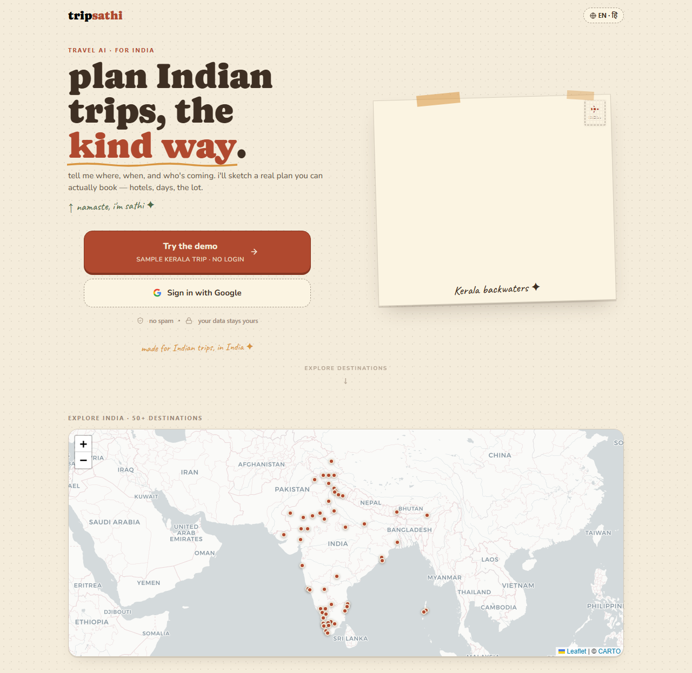
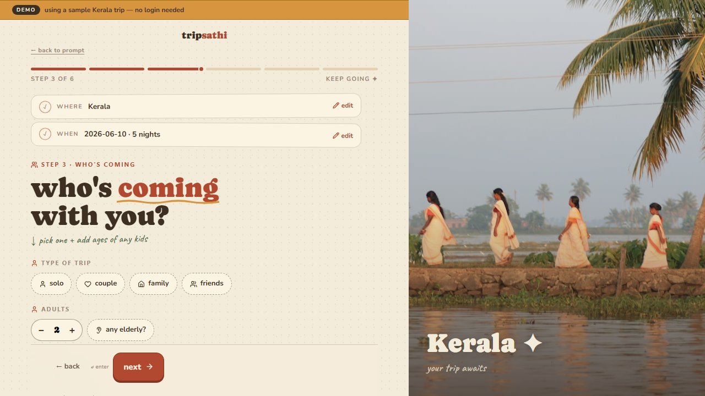
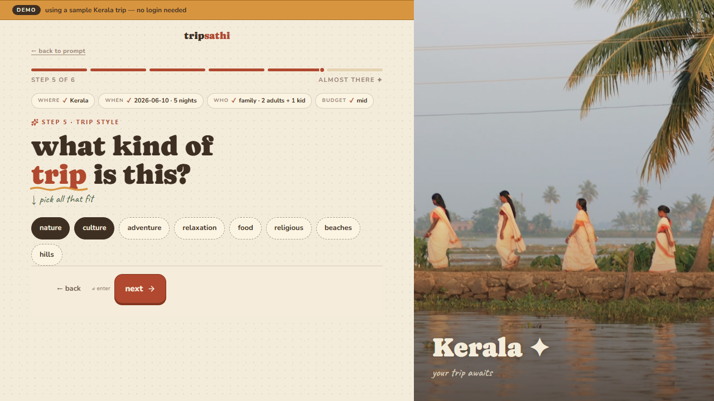
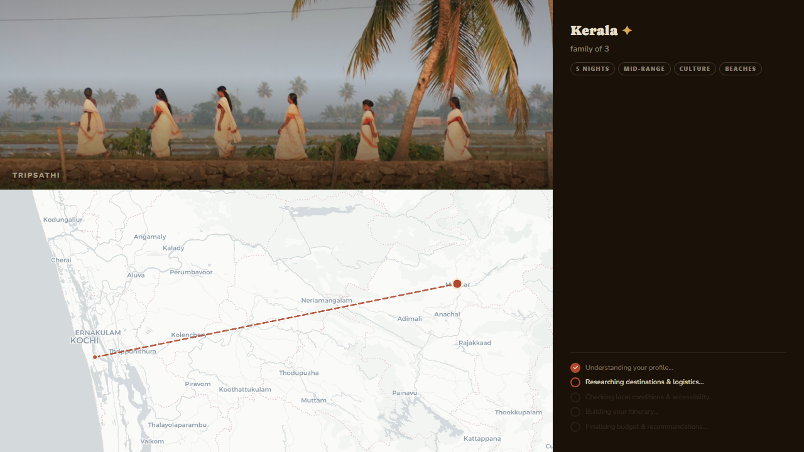
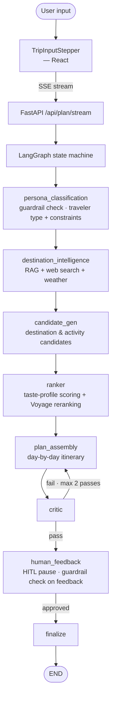
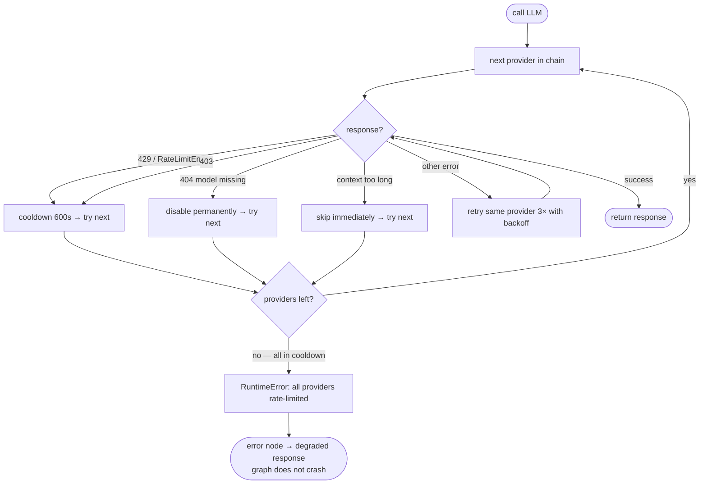

# TripSathi — AI Travel Planning Agent

[](https://github.com/anirbanpx/tripsathi/actions/workflows/ci.yml) [](LICENSE)   [](https://tripsathi-app.vercel.app)

Planning a multi-day trip across India usually means a dozen browser tabs: generic top-10 lists, scattered forum warnings about houseboat scams, monsoon road closures nobody mentions until you're stuck, and zero accounting for traveling with a toddler or elderly parents. TripSathi does that stitching for you — a multi-agent system that researches, plans, and refines a day-by-day itinerary against your actual constraints.

The original idea was bigger than a planner: a personal travel concierge that researches, plans, books, and remembers you across trips — not just a one-shot itinerary generator. What's live today is the core of that — research, planning, self-critique, human-in-the-loop refinement, voice input, and memory that carries across sessions and trips, plus a simulated end-to-end booking flow. Group trip coordination and real OTA booking integration are the next layers, not yet built.

It works like a small team of specialist agents handing the trip off to each other:

| What | Tech | Why |
|---|---|---|
| **Persona Agent** figures out who's actually traveling — family with a toddler, solo explorer, pilgrimage group — and what they care about | Classifies onboarding answers into a traveler profile + constraints | Every later suggestion is filtered through what fits *you*, not a generic tourist |
| **Research Agent** digs through curated destination guides, live weather, and the web for local know-how | RAG search + weather + web search, run together | Surfaces scam warnings, monsoon timing, and insider tips a search engine buries on page 4 |
| **Planning Agent** shortlists places that match your taste, then assembles them into a real day-by-day schedule | LLM candidate generation + taste-based reranking + itinerary assembly | A plan with actual timing and logistics, not just a list of attractions |
| **Critic Agent** reviews its own plan before showing it to you, catching mismatches against your preferences | Self-critique loop, retries up to twice | Fewer "wait, this won't work for my family" surprises |
| **Refinement Agent** lets you ask for changes and picks up exactly where you left off | Human-in-the-loop pause/resume | Tweak the plan instead of starting over |
| **Reliability Agent** keeps things responding even if one AI provider runs out of capacity | Automatic failover across 4 LLM providers | No "service unavailable" mid-plan |

*(Agent names are a product-level simplification of the underlying LangGraph nodes — directionally accurate, not a 1:1 mapping. See [Architecture](#architecture) below for the real pipeline.)*

**Live demo:** [tripsathi-app.vercel.app](https://tripsathi-app.vercel.app)

### Screenshots

| Landing | Onboarding | Trip style |
|:---:|:---:|:---:|
|  |  |  |

| Agent pipeline (persona + guardrails) | Agent pipeline (research + map) |
|:---:|:---:|
|  |  |

---

## Tech Stack

**AI & Orchestration**

| Layer | Technology |
|---|---|
| LLM | Groq (`openai/gpt-oss-120b`) + 3-provider failover (Cerebras, Gemini, OpenRouter) |
| Orchestration | LangGraph state machine |
| RAG / Indexing | LlamaIndex + Qdrant Cloud |
| Reranker | Voyage rerank-2.5 + Cohere fallback |
| Memory | LangGraph checkpoints + TasteProfile SQLite + Mem0 Cloud |
| Guardrails | Regex prompt-injection filter + `gpt-oss-safeguard-20b` (Groq) unsafe-content classifier |
| Evaluation | DeepEval |
| Observability | Arize Phoenix (OpenInference auto-instrumentation) |

**Integrations**

| Layer | Technology |
|---|---|
| Web / Maps / Weather | Tavily, Google Maps, OpenWeatherMap |
| Voice | Whisper STT |
| Auth | Google OAuth + JWT |

**Application**

| Layer | Technology |
|---|---|
| Frontend | React 19 + TypeScript + Vite + Tailwind CSS |
| Maps (frontend) | Mapbox GL (plan view) + Leaflet/react-leaflet on CARTO tiles (explore view) |
| Backend | FastAPI + Python 3.12 |
| Testing (E2E) | Playwright |
| Deployment | Railway (backend) + Vercel (frontend) |

---

## Architecture

### Request → plan pipeline



Every node also has a conditional edge to a terminal `error` node — a failed node never lets a downstream node run on corrupted state.

RAG knowledge base covers 54 destinations with curated markdown docs and 50 YouTube video transcripts, indexed in Qdrant Cloud.

### LLM failover

Two routing chains, picked by task type — reasoning-heavy tasks favor Groq's quality, long-context tasks favor Gemini's window:

| Chain | Order |
|---|---|
| `plan`, `critic` | Groq → Cerebras → Gemini → OpenRouter |
| `synthesis`, `candidate_gen` | Gemini → Groq → Cerebras → OpenRouter |



Full failover mechanics (Gemini SDK special-casing, cost notes) and the rest of the state machine: **[specs/backend_architecture.md](specs/backend_architecture.md)**

### Memory

Three independent layers, each solving a different recall problem:

```
Layer 1 — LangGraph checkpoints (checkpoints.db, SQLite)
  Session-scoped. Full graph state frozen on every node completion —
  this is the mechanism behind HITL pause/resume. A 24h TTL cleanup
  job expires stale threads instead of letting them accumulate
  (main.py: _cleanup_expired_threads).

Layer 2 — TasteProfile (data/taste.db, SQLite)
  Permanent, per-user. 7 scalar taste dimensions (pace, crowd
  tolerance, food adventurousness, ...) + 10 weighted interests +
  a per-dimension confidence score (starts 0.1, +0.2/session) used
  by the ranker node to weight how much to trust each signal.

Layer 3 — Mem0 Cloud (cross-device)
  Free-text preference summaries, searched by user_id.
  read_memories() in persona_classification injects past trips as
  context → write_memory() in finalize persists this session's
  learnings. Silently no-ops if MEM0_API_KEY is unset — degrades,
  never breaks the pipeline.
```

### Observability

Arize Phoenix, enabled via `PHOENIX_ENABLED=true`:

```
FastAPI startup
      │
      ▼
phoenix.otel.register(project="tripsathi", endpoint=PHOENIX_COLLECTOR_ENDPOINT)
      │
      ▼
OpenInference auto-instrumentors attach to:
  ├── LangChainInstrumentor   — every LLM call + chain step
  ├── LlamaIndexInstrumentor  — every RAG retrieval + embedding call
  └── OpenAIInstrumentor      — raw OpenAI-compatible client calls
                                 (Groq / Cerebras / OpenRouter)
      │
      ▼
+ one manual span (tools.py: web_search) — tool.name, input/output.value,
  result_count, and exception recording on the Tavily → DuckDuckGo fallback
      │
      ▼
Phoenix UI (localhost:6006 locally, or PHOENIX_COLLECTOR_ENDPOINT + API key
for a hosted collector) — one trace per request, persona_classification
through finalize, with nested LLM/RAG/tool spans and token counts per call
```

Gated behind `PHOENIX_ENABLED=true` and wrapped in `except ImportError: pass` — observability is opt-in and a missing dependency or unset flag never blocks a deploy. `PHOENIX_API_KEY` is only needed for a hosted collector; local traces work without it.

---

## Example

*Illustrative — representative of system behavior, not a captured log.*

```
Input:  "5 days in Kerala, family with a 3-year-old, mid-range budget"

persona_classification     → family_with_kids, constraints: {kid_age: 3}
destination_intelligence   → 7 persona-specific RAG queries (toddler nap
                              spots, houseboat safety, monsoon timing)
                              + live weather + web search
candidate_gen               → 18 candidates tagged toddler_ok / indoor / cost_tier
ranker                      → reordered by taste fit (pace=2, crowd_tolerance=2)
plan_assembly                → day-by-day itinerary; houseboat overnight swapped
                              for a day cruise (toddler rule); nap blocks added
critic                       → verdict: pass
human_feedback                → graph pauses here; user can request changes

Output (excerpt):
  Day 2 — Alleppey
    09:00  Backwater day cruise (overnight houseboat swapped — toddler-safe)
    13:00  Nap block at cruise-adjacent resort
    16:00  Village walk, easy terrain
    ⚠ Avoid unlicensed houseboat operators near Finishing Point jetty
```

---

## Key design decisions

| Decision | Choice | Why |
|---|---|---|
| Orchestration | LangGraph state machine | SQLite checkpointing enables HITL pause/resume; conditional edges encode retry logic cleanly. Accepted cost: steeper learning curve than linear code, and breaking API changes across LangGraph minor versions |
| LLM | Groq + 4-tier failover (Cerebras, Gemini, OpenRouter) | Groq's 200k tok/day free tier is the fastest reasoning model available, but exhausts in ~9 plan runs — task-aware failover (Groq-first for reasoning, Gemini-first for long-context synthesis) is what makes a free tier viable in production. Accepted cost: ~200ms per failover hop, plus per-provider JSON response normalization |
| Vector store | LlamaIndex + Qdrant Cloud over embedded ChromaDB | Needed managed, metadata-filterable retrieval reachable from both the Railway backend and standalone eval scripts — not just one process. Accepted cost: 1GB free-tier storage ceiling; Cohere embedding fallback degrades quality slightly when the Voyage key is unavailable |
| Streaming | SSE over WebSockets | One-directional push is all that's needed; browser-native EventSource; passes through Vercel's CDN and Railway's reverse proxy without a WS upgrade. Accepted cost: each connection holds open for the full ~30–45s generation window |
| Memory | 3-layer model | LangGraph checkpoints (session HITL, 24h TTL) + TasteProfile SQLite (permanent preferences) + Mem0 Cloud (cross-device recall). Accepted cost: an extra network call to Mem0 at session start; degrades to a cold start if Mem0 is unavailable |
| Eval | DeepEval + GEval | GEval (plan quality, 4–7 criteria/case) + RAG metrics (Faithfulness, AnswerRelevancy, ContextualRelevancy) + 3 custom BaseMetric (PersonalizationDelta, TasteAdherence, ConstraintAdherence) |
| Observability | Arize Phoenix | OpenInference auto-instrumentors for LangGraph + LlamaIndex + OpenAI; manual OTel spans for tool calls |
| Guardrails | Two-tier: free regex filter, then `gpt-oss-safeguard-20b` (Groq) only if tier 1 passes | Avoids a heavy `llm-guard`/NeMo Guardrails dependency (torch + transformers, multi-GB) for a project with no PII/auth in its core flow. Accepted cost: regex patterns need manual upkeep and miss novel injection phrasing that an ML classifier would catch |
| LLM caching | Exact-match SHA-256 cache (opt-in, `LLM_CACHE_ENABLED=true`), not semantic caching | Semantic caching risks returning a cached plan for a superficially similar but constraint-different query — e.g. same destination, different party composition. Correctness under personalization constraints outweighs the latency saving. Exact-match is safe: identical inputs produce identical outputs, so cache hits are never wrong |

Full architecture document with state machine diagrams, RAG pipeline, failover chain, auth flow, and known trade-offs: **[specs/backend_architecture.md](specs/backend_architecture.md)**

---

## Quick Start

**Prerequisites:** Python 3.12, Node.js 18+, API keys (see `backend/.env.example`)

### Backend

```bash
cd backend
python -m venv venv
venv\Scripts\activate        # Windows
# source venv/bin/activate   # macOS/Linux
pip install -r requirements.txt
cp .env.example .env         # fill in your API keys
uvicorn main:app --reload
```

API available at `http://localhost:8000`.

### Frontend

```bash
cd frontend
npm install
npm run dev
```

UI available at `http://localhost:5173`.

---

## Project Structure

```
.
├── backend/          # FastAPI + LangGraph agent server
│   ├── rag/         # RAG indexing + destination knowledge base
│   └── tests/       # Unit + integration test suite (8 files, ~150 tests)
├── frontend/         # React + Vite chat UI
│   └── src/
│       ├── components/  # UI components organized by feature
│       ├── pages/       # Route-level pages
│       ├── lib/         # Utilities + static data maps
│       └── services/    # API client
├── specs/            # Architecture, MVP, and UX specifications
└── data/             # DeepEval evaluation datasets
```

---

## Evaluation

Three-tier eval suite — regex smoke tests, LLM-as-judge GEval, and RAG-layer metrics:

```bash
cd backend

# Run a single case
python run_eval_deepeval.py BASE-KL

# Run specific cases
python run_eval_deepeval.py BASE-KL A-KL-01 B-PU-01

# Run all 10 cases
python run_eval_deepeval.py

# Named suites
python run_eval_deepeval.py --suite personalization   # PersonalizationDelta, TasteAdherence, ConstraintAdherence
python run_eval_deepeval.py --suite refinement        # HITL loop: plan v1 → user feedback → plan v2
python run_eval_deepeval.py --suite all               # everything above + all 10 cases
```

**Metrics per case:**
- GEval (4–7 criteria, `GroqJudge` / `gpt-oss-120b`) — semantic plan quality: routing, constraints, implicit local knowledge
- `FaithfulnessMetric` — plan does not contradict retrieved RAG context (hallucination check)
- `AnswerRelevancyMetric` — plan addresses the user's actual request
- `ContextualRelevancyMetric` — retrieved RAG chunks are relevant to the query (retriever quality signal)

RAG metrics use `SimpleGroqJudge` (`llama-3.3-70b-versatile`) — required for schema-structured output that DeepEval's built-in metrics expect.

**10 test cases** across Kerala, Puri, and Guwahati: BASE (baseline), A-series (explicit constraints), B-series (implicit local knowledge).

Fast regex smoke test (no API keys, offline):
```bash
python run_eval.py            # BASE-PU and BASE-GW
python run_eval.py BASE-PU    # specific case
```

---

## Engineering Practice

This system was self-reviewed against five dimensions — agentic patterns, error handling, knowledge usage, cost/latency, and security — producing a graded scorecard and a prioritized punch list. Several P0/P1 items from that review are already shipped since: a terminal `error` node now routes every node's failure state to a clean stop instead of letting downstream nodes run on bad state (`backend/graph.py`), Mem0 cross-session memory is wired into `persona_classification`/`finalize` (`backend/nodes.py`), and HITL sessions now expire via a 24h TTL cleanup job instead of accumulating indefinitely (`backend/main.py`). Others remain open and tracked.

Full scorecard and punch list: **[ARCHITECTURE_REVIEW.md](ARCHITECTURE_REVIEW.md)**

---

## Deployment

- **Backend:** Railway — root directory `Agent/backend`, builds from `Procfile`
- **Frontend:** Vercel — pre-built deploy (see `frontend/README.md` for the exact commands)

Built and maintained solo as an ongoing personal project.
